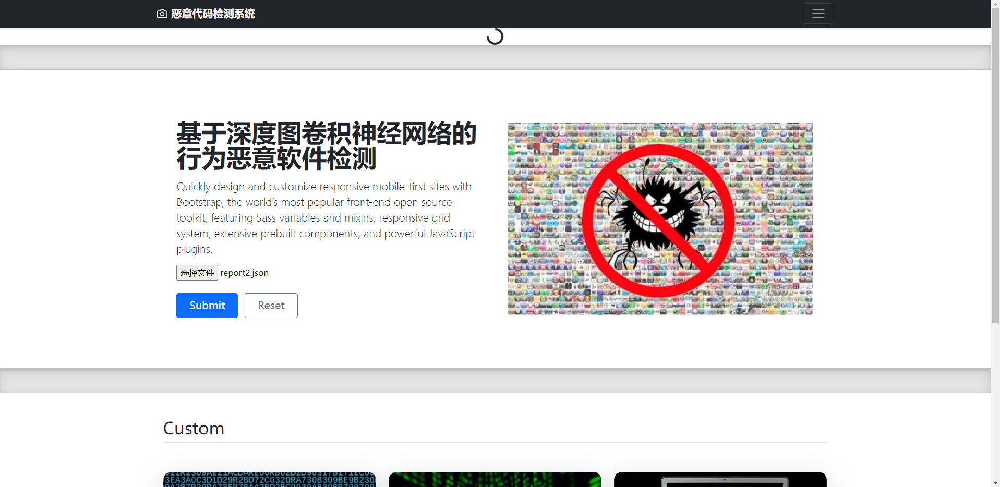
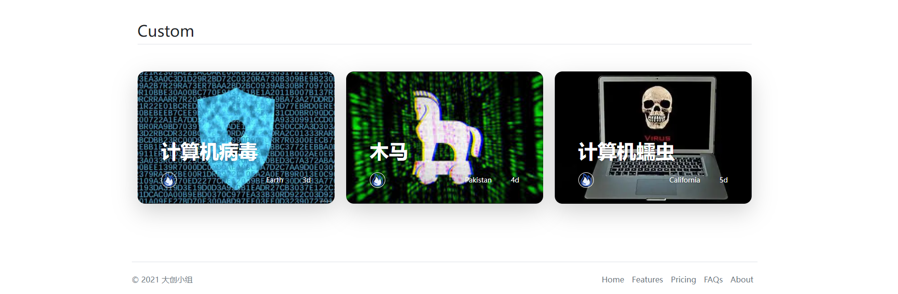
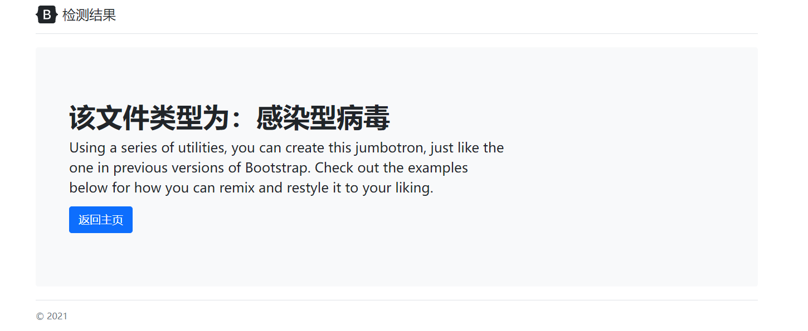

# 基于图卷积恶意代码检测大创

* 项目后端采用flask搭建，前端基于bootstrap框架。

* 共三个界面：upload，wrong，result。
* 前端上传cuckoo沙箱分析出的report文件，保存至后端report文件夹中。
* 上传后调用Predict函数对report中的API序列进行提取并分析预测。
* 恶意代码检测结果结果返回至前端result界面

#### 本地：D:\PycharmProjects\flaskProject

